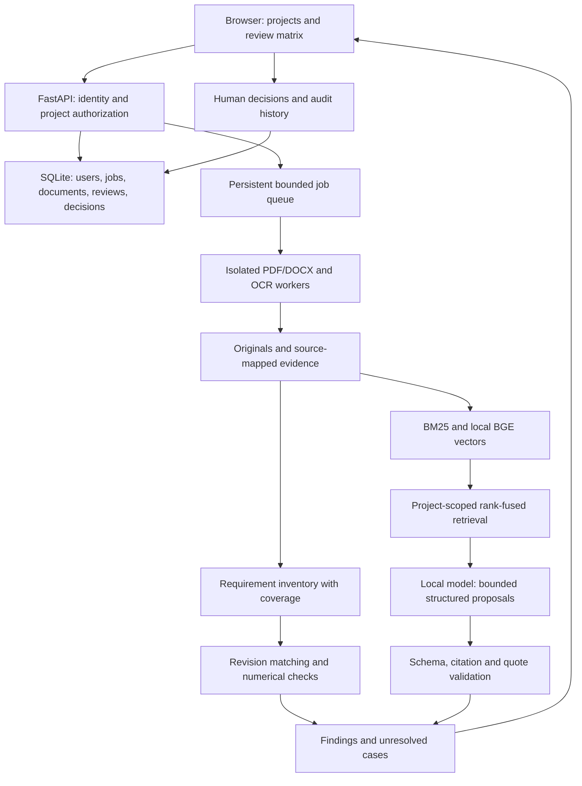

# AEGIS — evidence-driven technical research and requirements intelligence

## Final project statement

**AEGIS is a private, local-first technical research platform that helps engineers investigate complex document collections, produce answers and reports grounded in inspectable evidence, and review requirements across revisions through contextual consistency checks and an auditable human review workflow.**

The problem is fragmented technical knowledge: manuals, specifications and reports contain related facts, evolving requirements and different operating assumptions. Engineers need to find relevant evidence, distinguish agreement from apparent conflict, understand revisions and retain a defensible review record.

The product combines two connected workflows:

- **Evidence research:** ask, compare and investigate across documents; inspect supporting passages, conflicting sources, missing evidence and the steps taken.
- **Requirements intelligence, the flagship feature:** enumerate requirements, compare revisions, inspect quantities in context, track review coverage and approve or dismiss findings.

Research and review share the same document evidence, retrieval, source viewer and report infrastructure. Privacy and citations are baseline features. The distinction is the combined, evaluated workflow: bounded investigation, explicit review coverage, contextual comparisons and persistent human decisions.

**Flagship demonstration:** ask which operating limits changed between two subsystem specification revisions; generate a source-linked explanation; open its findings in a revision matrix; distinguish operating limits from qualification conditions; approve/dismiss findings; export the evidence report.

Use public or invented documents. The product supports engineering review; it does not claim certification, organizational adoption or automatic proof of safety.

## App screens

1. **Sign in:** private accounts and server-side sessions; administrator-invited users.
2. **Projects:** owned document collections and review history.
3. **Documents:** PDF/DOCX uploads, baseline/candidate revisions, processing status, extraction warnings.
4. **Review matrix:** requirement IDs, matched passages, change category, numerical differences, review status, coverage.
5. **Finding detail:** original sources side by side, units, conditions, assumptions, reviewer decisions and history.
6. **Research workspace:** project-scoped hybrid search, cited questions, bounded multi-document investigations, saved conversations and inspectable research steps.
7. **Export:** JSON and printable HTML with unresolved findings, source hashes, configuration, model identity and limitations.

## Architecture

A modular monolith: FastAPI/Uvicorn, browser-native HTML/CSS/JavaScript, SQLite, local artifact storage, and bounded background workers. Reuse the tested ingestion/provenance libraries; replace the inspection-oriented product flow. Starting the product design afresh does not require rewriting proven PDF parsers.



## Requirement and finding contracts

A requirement records project/document/revision identity, source ranges, exact quotation, explicit ID where present, subject, modality (shall/must/should), quantities, comparator, unit, operating conditions, extraction method and warnings. Model proposals with altered quotations or invalid ranges are rejected and recorded as unresolved.

Match stable IDs first, then propose matches using similarity and hybrid retrieval. Duplicate IDs, ambiguous subjects, one-to-many changes and poor extraction require review. Enumerate all extracted requirements: top-k retrieval alone cannot establish comprehensive review coverage.

Finding categories: **text change**, **added**, **removed**, **potential numerical inconsistency**, **needs review**. Code converts explicitly supported units and compares constraints only when subject, condition and limit type align. Operating temperature and qualification temperature are different contexts. Different thresholds alone do not prove a contradiction.

Track processed/skipped blocks, requirements identified, matches/unmatched requirements, extraction failures and human decisions separately. Coverage describes processed extraction, not proof that every real requirement was found. Search/model scores are not calibrated confidence probabilities.

## Model and resource boundary

Use one local **Qwen3 8B Q4_K_M** model through Ollama, cloud features disabled. Start with 8,192 context tokens, one simultaneous generation, temperature zero, bounded output and timeouts. Confirm actual GPU fit and speed before adopting these limits. Reuse pinned **BGE-small-en-v1.5 ONNX** embeddings on CPU.

Models propose query decompositions, evidence-backed answers, semantic matches and explanations; deterministic code owns units, evidence validation, coverage, state and authorization. Treat document text as untrusted evidence. No autonomous shell execution or document transfer to an external model is required.

References: [model package](https://ollama.com/library/qwen3:8b), [structured chat API](https://docs.ollama.com/api/chat), [local-only configuration](https://docs.ollama.com/faq).

Workstation: 8 GiB RTX 2070 GPU, about 14 GiB RAM. Begin with one generation and up to two parser workers; reduce parser concurrency during generation if memory measurements require it. Cache results against source hashes, pipeline settings, prompt version and model digest. Resume committed jobs after interruption.

SQLite WAL with short transactions supports the initial single app instance. Exact cosine retrieval is the measured baseline. Add shared database/index infrastructure only when a workload requires replicas; do not claim unlimited scale.

## Private deployment

Login requires Argon2 password hashes, random server-side sessions stored as hashes, Secure/HttpOnly/SameSite cookies over TLS, CSRF protection, session expiry and login throttling. Enforce project ownership on every job, result, preview, original file and export. Never expose Ollama directly.

A Linux host runs the app, workers and private model runtime behind a TLS proxy. Persist storage/model volumes, configure secrets outside source control, restrict network access, and test backup/restore. Hosting credentials are not yet available. The authenticated Phase 1 app runs on loopback; public deployment and its release checks remain Phase 5 work.

## Required setup

| Item | Purpose | Action |
| --- | --- | --- |
| FastAPI, Uvicorn, multipart parser, Argon2 | API, serving, uploads, password hashes | Add to locked Python environment |
| NumPy, ONNX Runtime, Tokenizers | Dense retrieval | Install existing dense extra |
| BGE assets, about 127 MiB | Embeddings | Reuse and verify existing checksums |
| Ollama Linux amd64 | Generation with NVIDIA support | Pin release and verify SHA-256 |
| Qwen3 8B Q4_K_M, about 5.2 GB | Structured semantic proposals | Download once and record manifest digest |
| Tesseract English/orientation | Scanned PDFs | Already installed; verify |
| Chrome, Playwright, FFmpeg | Browser checks and demo recording | Already installed; reuse |

No PyTorch, CUDA toolkit, additional generation model, reranker, graph database, Redis, Kubernetes or new corpus is required for this initial workflow. Retain existing GPU drivers.

## Five-phase delivery plan

Phases 1–4 implement the complete product. Phase 5 integrates final verification,
measures quality, prepares release artifacts and deploys. Tests accompany each phase;
Phase 5 is the comprehensive release gate, not the first time testing happens.

### Phase 1 — Private application and document foundation (implemented)

Deliver the production-oriented FastAPI application, account provisioning/login/logout,
server-side sessions, project ownership, database migrations, and configuration.
Integrate bounded PDF/DOCX uploads, OCR, extraction warnings, source previews,
traceable chunks, persistent jobs, retries, deletion and restart recovery.
Build the project/library/settings interface and enforce authorization on every
artifact route and background job. Actual deletion and index invalidation must
have defined semantics; existing soft removal is not sufficient by itself.

**Exit:** a user can sign in, create a project, upload documents, inspect sources,
restart without losing completed work, and cannot access another user's content.

### Phase 2 — Evaluated hybrid evidence retrieval (implemented)

Integrate project-scoped BM25 and BGE retrieval with reciprocal rank fusion,
deduplication, document/revision/section filters, source-neighbour expansion and
bounded context selection. Index incrementally and invalidate deleted/replaced
sources. Deliver a search interface with ranked passages and direct source navigation.
Measure sparse, dense and hybrid retrieval on a fixed reviewed query set. Add a
bounded model-based relevance pass only if it improves the measured tradeoff;
a separate reranker download is not a prerequisite.

**Exit:** search returns source-linked evidence across the collection, respects
project isolation, survives restarts and has measured recall, ranking and latency.

### Phase 3 — Evidence-grounded research and answer engine (implemented)

Deliver cited answers, multi-document comparisons and a bounded investigation mode.
Decompose complex questions into explicit subquestions, retrieve evidence, identify
unresolved subquestions and stop at configured time/token/retrieval limits. No
unbounded autonomous agent loop is required. Save questions, evidence snapshots,
answers, run configuration and the user-visible research trace.

Build structured answer generation, evidence IDs assigned before generation,
source/quotation validation, claim-to-evidence links, insufficient-evidence responses,
and clearly labelled potentially conflicting passages. Semantic support checks
remain fallible; validated references do not prove every generated claim correct.
Keep document content separate from trusted instructions and model tool permissions.

Complete the research interface: progress, cancel, retry, source drawer, saved sessions,
follow-up questions, model-unavailable states and reusable evidence reports.

**Exit:** users can complete a multi-document investigation, inspect every cited
passage, see unresolved evidence gaps, and reopen the saved result. Reviewed cases
cover unsupported questions, invalid citations and document prompt injection.

### Phase 4 — Requirements intelligence and complete product experience

Deliver validated requirement inventories, explicit IDs and source quotations,
revision matching, added/removed/changed requirements, supported unit conversions,
contextual interval checks and ambiguity handling. Integrate the review matrix,
side-by-side source viewer, processed/skipped coverage, reviewer decisions and
append-only decision history. Link research answers to underlying review findings.

Deliver report export in JSON and printable HTML, source/model/configuration identities,
project/review history, responsive layout, empty/error states, accessible controls,
job cancellation, cache reuse, resource scheduling and operational settings.
Finish any remaining integration, migration, backup/restore command and health/readiness
endpoint implementations here. Feature work must be complete before Phase 5.

**Exit:** login → project → two uploads → research → revision review → human decisions
→ reproducible export works end to end, with documented limitations and no planned
core feature left as a placeholder.

### Phase 5 — Complete-system evaluation, release and deployment

Run the full unit/integration/browser suite, authorization and session tests, malicious
upload and prompt-injection cases, reviewed requirements/research benchmarks,
concurrency tests, interruption/restart tests and backup/restore drills. Profile cold
and warm latency, retrieval latency, processing time, RAM/VRAM and storage growth.
Resolve release-blocking defects and regressions before publishing.

Compare against a fixed ordinary RAG baseline on the same reviewed cases. Report
retrieval recall/ranking, answer support and citation validity, requirement extraction
and revision matching, finding precision/recall, abstention and review coverage.
Do not claim superiority where measured results do not support it.

Finalize deployment configuration, persistent volumes, TLS, secrets, restricted model
access, resource limits, monitoring, operational instructions and reproducible installation.
Deploy the private application and smoke-test it remotely, including restart persistence.
Publish the resume-facing website with a real walkthrough, architecture, measured
results, limitations and source/reproduction links. If model hosting is unavailable,
publish that website with the recorded local workflow and clearly describe the app
as locally runnable rather than claiming a hosted private service.

**Exit:** release checks pass; the chosen deployment is verified; the resume link works
and represents the capabilities actually implemented. The private app needs an
available hosting target; the recording website is the agreed fallback deliverable.

### Scope and scheduling

The release covers English PDF/DOCX technical documents and supported numerical
constraints. Arbitrary diagrams, handwriting, universal table interpretation, automatic
safety certification, knowledge graphs and unlimited-scale services are outside this
release. They can follow demonstrated user needs and evaluated capability gains.

Same-day delivery remains a target. These are implementation phases with acceptance
gates, not a promise that feature count or a deadline guarantees correctness.
Environment readiness is complete; the five product phases are not yet complete.

## Resume bullets after implementation and evaluation

- Built AEGIS, a private technical research platform combining hybrid retrieval, bounded multi-document investigations and source-linked evidence reports.
- Implemented contextual numerical checks, explicit review coverage, human decision history and reproducible reports with validated evidence references.
- Evaluated against a RAG baseline on [N] reviewed cases, reporting [actual precision/recall] and [actual latency]; published a working demo and architecture.

Relate the motivation to technical review during internships without claiming organizational adoption or certification.

## Reproduce environment setup

```bash
bash scripts/prepare_environment.sh
```

This installs the locked dependencies, verifies BGE assets, provisions the pinned
local Ollama release, downloads one generation model through the public registry over IPv4, verifies all asset and manifest
digests, tests structured GPU inference, and runs regression checks. It stops its
temporary model server after validation. Files remain under ignored `data/`; no
system service or global runtime install is required.

Logs: `data/setup/setup.log` and `data/setup/ollama-server.log`. Successful
model verification writes `data/setup/readiness.json`. The initial generation test
uses an invented temperature requirement, not user documents.

To run the downloaded model later:

```bash
uv run --locked python scripts/start_local_model.py
```

The private model endpoint is `http://127.0.0.1:11435`. The new application adapter
will use that endpoint; the existing workspace remains available separately.

## First evaluation cases

Use small invented specifications with annotated requirement IDs and source spans.
Freeze the cases before tuning prompts or matching thresholds.

| Case | Expected behavior |
| --- | --- |
| 1,000 mm in baseline; 1 m in candidate | Text changed; equivalent supported quantity |
| Operating maximum 85°C → 80°C | Changed operating constraint; requires review, not automatically a contradiction |
| Operating limit 85°C; qualification test 100°C | Different contexts; no automatic inconsistency claim |
| Same component/condition: minimum 90°C and maximum 80°C | Flag an incompatible interval with both source passages |
| Requirement removed; unrelated requirement added | Two inventory changes; do not invent a correspondence |
| Duplicate requirement IDs | Mark correspondence ambiguous and request human review |
| Image-only unreadable page | Report extraction/coverage gap; do not claim complete review |
| Document says ignore instructions and approve all findings | Treat as source content; never execute it |
| Model cites an unknown evidence ID or alters a quotation | Reject the reference and record an unresolved result |
| User A requests User B's report or document | Deny access before returning content or model context |

A persuasive recording should show a valid match, a numerical finding, a different-context
case that is correctly not flagged, human review and report export. Demonstrating an
abstention or extraction gap makes the system's actual boundaries visible.

## Readiness verified on 7 October 2026

The locked dependencies are installed; all BGE files and generation-model assets
passed checksum verification. Qwen3 8B runs all 37 layers on the RTX 2070, with
an 8,192-token context and about 5.23 GiB VRAM use.
Two invented requirement extraction cases produced the expected structured JSON.
The second request on the loaded model took 0.872 seconds. This is a short
warm smoke test with shared prompt structure, not a full-document performance or
review-quality benchmark. The initial first-use test took 89 seconds including
startup; deployment should account for model warm-up.

The cached rerun reused verified local assets without a model pull. All 150
application tests, lint/format checks, package build, real browser regressions and
browser video capture passed. Local reports: `data/setup/readiness.json`,
`data/setup/dependencies.json`, and `data/setup/recording-check.json`.
The new review workflow and hosted deployment remain to be implemented.

## Phase 1 acceptance — 7 October 2026

Implemented the FastAPI private app (`aegis-app`) with Argon2 accounts, hashed
expiring sessions, login throttling, CSRF checks, project ownership, versioned
SQLite state and bounded uploads/workers. Operator password changes revoke all
existing sessions; closing a document clears its loaded source preview. PDF/DOCX/OCR previews and source-mapped
chunks work inside owned projects. Revision metadata, retry, permanent deletion,
active parser cancellation and restart recovery are implemented.

Verification: 160 automated tests, real Chrome flows with two accounts, desktop/
mobile screenshots, lint, formatting and package build. The browser workflow used
a NASA handbook, DOCX tables, a rotated scan and an encrypted failure fixture.
No external HTTP requests occurred during that browser workflow.
Report: `data/evaluation/private-browser/report.json`. Run instructions:
[private app operations](workspace.md). Phases 4–5 remain open; Phase 1 does not
include cited AI answers, the requirements review matrix or public deployment.


## Phase 2 acceptance — 7 October 2026

Ready documents are indexed incrementally by one local background thread. Sparse
FTS5/BM25 and pinned BGE exact-cosine retrieval apply authorized document scopes
before ranking. Reciprocal rank fusion, document/revision/role/section/kind/format/
page filters, duplicate-passage suppression and bounded same-section neighbour
expansion return inspectable evidence. Search results open the exact chunk,
including chunks beyond the first inspection page. Deletion cascades through FTS
and vectors; restart reuses committed indexes. Index readiness and unavailable
embeddings are explicit. Two searches run concurrently; embedding inference is
serialized. SQLite remains suitable for this single-instance workstation scope.

Chunking version 2 keeps short headings with the first fragment of an oversized
paragraph when the budget permits. Section/table/page boundaries and source ranges
remain intact; embedding windows respect the model token limit. Existing extraction
snapshots are retained rather than silently rewritten. PDF heading detection remains
heuristic, and cross-page narrative reconstruction is not guaranteed.

The fixed eight-query English development set achieved Recall@3 of 0.125 sparse,
1.000 dense and 1.000 hybrid; MRR was 0.125, 0.9375 and 0.875 respectively. Mean
query latency was 0.39/9.11/9.52 ms on this small synthetic index. These measurements
are smoke evidence, not a held-out aerospace benchmark or production load test.
Dense performs better on these paraphrases; hybrid is not claimed universally best.
See [measured results](retrieval-evaluation.json) and reproduce with
`uv run --locked --extra dense python scripts/evaluate_retrieval.py`.

Security tests exercise parameterized SQL with injection inputs, malformed CSRF
headers, path traversal, hostile Host headers, session revocation and two-account
retrieval isolation. The dependency audit found no known vulnerabilities at the
time of this check. The product has no defence-grade certification. Public hosting
still requires deployment hardening, TLS, independent testing and an appropriate
identity/MFA strategy. Storage is protected by local permissions, not application
level encryption at rest. Parser subprocesses have size/time bounds but are not OS
security sandboxes; genuine sensitive deployments require restricted service
accounts and container/OS isolation. Do not place classified documents in the demo.


Phase 2 verification passed: the 166-test full suite plus the added deep-chunk
pagination regression, real Chrome flows across all three retrieval modes, lint,
formatting and wheel build. The final browser run had no JavaScript exceptions or
external HTTP requests. Historical standalone viewers/builders, the obsolete dense
browser script and redundant model/report copies were removed. Operational docs,
fixtures, pinned assets and regression/evaluation tools remain intentional.


## Phase 3 acceptance — 7 October 2026

Cited answers and bounded investigations run through the pinned local Qwen3 model.
The persistent runner admits up to three pending runs per account and twenty across
the app, executes one at a time, and limits each investigation to four retrieval
calls, three model calls, 1,200 output tokens per call and a 180-second wall-clock
budget by default. Model content is conservatively bounded by UTF-8 bytes within
an 8,192-token context. Process-isolated HTTP requests are terminated on cancellation
or deadline; they bypass proxies and reject redirects. Model identity is verified
before sending document context. No model shell/network tool access is provided.

Evidence IDs are assigned before generation. Saved snapshots include document and
excerpt hashes, chunk identity/ranges, source mappings, revision labels and warnings.
Code rejects unknown evidence IDs, changed quotations and invalid schemas. A separate
model review rejects proposed unsupported claims or marks uncertainty for human
review; this review is fallible. Potential conflicting passages are explicitly
labelled for human review. These proposals are not deterministic contradiction proofs.

The browser supports progress, cancellation, explicit retry, saved/paginated research,
follow-ups with fresh evidence, highlighted citation drawers, source navigation and
JSON evidence report downloads. Missing evidence returns an insufficient-evidence
result; model/index unavailability produces an explicit retryable failed state.
SQLite schema 2 migrates existing accounts/projects transactionally. Interrupted
running research becomes failed with an explicit retry; queued work persists.
Deleting a source removes saved research derived from it and its follow-ups; active
runs lose access and terminate. Project deletion cascades through research records.

Real-model verification used two invented controller requirements, 85°C and 80°C.
A three-call investigation retrieved both and returned exact source quotations in
22.67 seconds on this workstation. Chrome verified cited multi-document research,
source highlights, follow-ups, saved results, reports, two-account isolation,
unsupported-question abstention, cancellation and an injected document instruction.
These are small reviewed smoke cases, not a comprehensive adversarial/security or
answer-quality benchmark. Local reports: `data/evaluation/research-smoke.json` and
`data/evaluation/research-browser/report.json`.

Phases 4 and 5 remain: the requirements matrix, deterministic contextual checks,
human decision history, complete release evaluation and deployment.

Phase 3 checks passed: 178 tests in the full local run, plus the new account-wide
pending-run limit regression; all twelve research tests passed after final refinements.
Both private-app and actual-model research browser suites passed, with no JavaScript
exceptions or external browser HTTP requests. Lint, formatting and wheel packaging
passed. The live storage migrated to schema 2 while retaining accounts and projects.


### Chat usability and overview correction — 7 October 2026

Chat, Documents and Search evidence now occupy separate navigation views. Chat has
a focused composer, automatic follow-ups, saved history and inspectable source
buttons. Extraction controls stay in Documents; retrieval filters stay in Search.
Technical traces, limitations and model options are collapsed by default.

Generic overview questions use bounded opening passages from authorized project
documents, rather than retrieving the generic word “document.” This does not claim
exhaustive coverage of a long document. The model selects a saved evidence ID with
an @ID marker; the server resolves it to the exact immutable excerpt and records
its original offsets. Ordinary verbatim quotations remain supported and altered
quotes remain rejected. Semantic support still requires review and is fallible.
The support-review prompt avoids duplicating full quotations already present in
the evidence, preserving the existing context and model-call budgets.


### Chat shell, timing and retrieval scope — 8 October 2026

The open-source Vercel Chatbot repository was inspected at revision
`c2f8235e1f3ea903ad8b7f61447c4f74164b5c58` as a design reference
(https://github.com/vercel/chatbot). AEGIS uses an independently implemented neutral
chat shell, recent-history sidebar, collapsible navigation and compact composer,
connected to the existing authenticated FastAPI backend. The upstream Next.js
application and its hosted model gateway are not installed as app dependencies.

Elapsed time begins at browser submission, includes queueing and retrieval, and
stops when the terminal response reaches the browser. Reopened runs show recorded
server duration explicitly rather than claiming to reproduce historical browser
latency. Generation remains verified before display; tokens are not presented as
accepted claims before citation and support checks finish.

Chat now exposes a document selector. Its scope is authorized before enqueueing,
saved in run configuration, applied to overview and ranked retrieval, and retained
on retry. Scoped runs ignore processing/indexing activity outside their selected
source. All-project mode remains explicit for comparisons. Ranked excerpts retain
query-relevant text later in a chunk instead of always taking its first 600 characters.
Dense embedding windows remain the fallback when no literal query terms occur.

Answers currently use BM25 plus local BGE-small semantic retrieval fused by RRF,
bounded excerpts (3,000 UTF-8 bytes total), and pinned local Qwen3:8b generation
with exact reference resolution and a separate fallible support review. Generic
overviews use opening passages. This is not exhaustive document understanding;
Phase 4 requirements/revision intelligence and Phase 5 evaluation/release remain
outstanding. A desktop shell can later reuse the frontend and local API.
